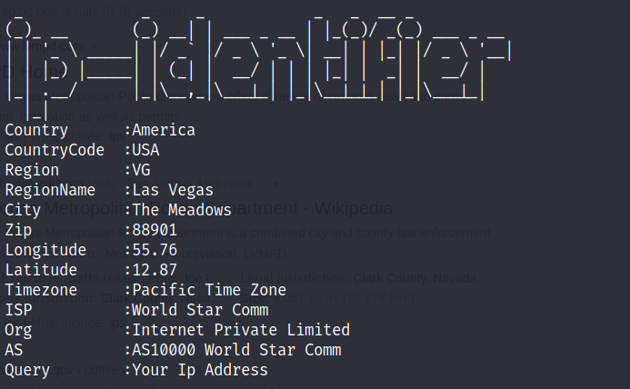

# IP-IDENTIFIER

An Open Source Tool For Information Gathering 


## Features

- Scan both ipv4 and ipv6 Address

- Get exact ---
  + Country
  + CountryCode
  + Region
  + RegionName
  + City 
  + Zip
  + Latitude (May Vary)
  + Longitude (May vary)
  + Timezone 
  + Intermet Service Provider

    And Many More....!!!

  + Get a good looking interface
  + Easy to use 

  

   


 

  
## Installation

```
git clone https://github.com/prince-gautam200/IP-IDENTIFIER.git

cd IP-IDENTIFIER/

chmod +x requirements.sh

./requirements.sh

ip-identifier <ip address>
```

## Usage

Usage: ip-identifier <ip-address>

  
## License

MIT License

  
